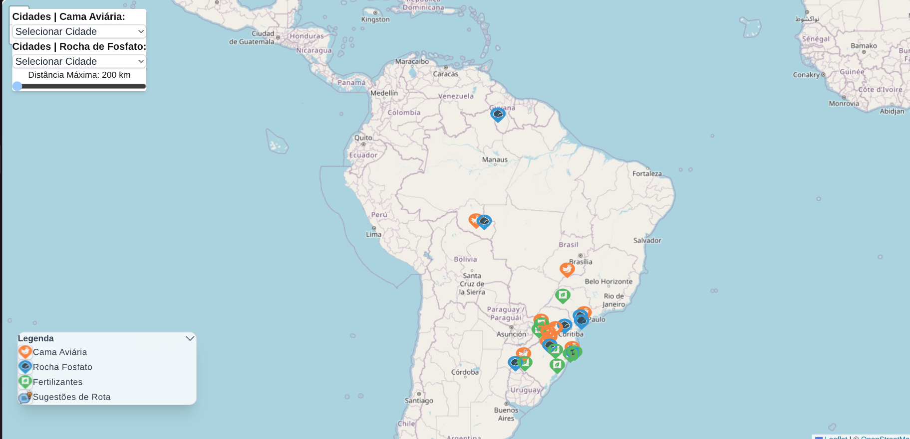
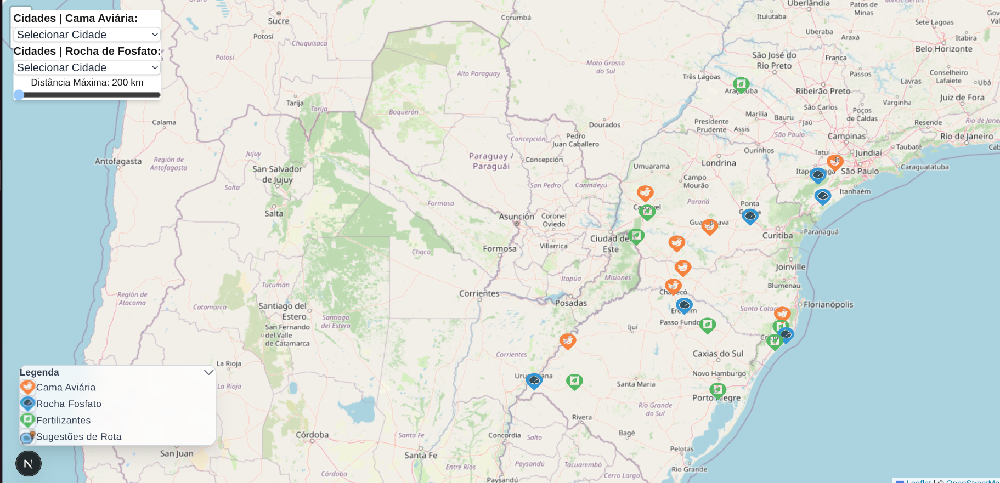
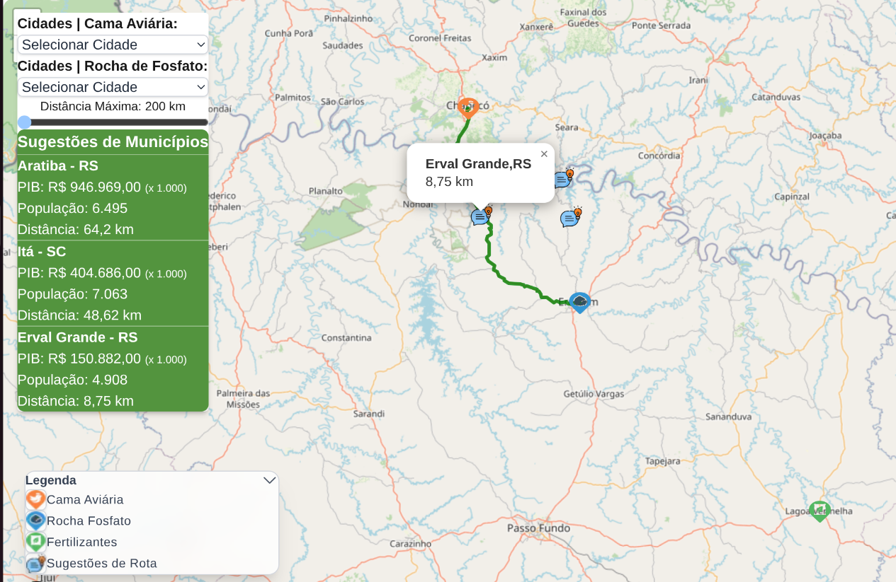

🗺️ Mapa Estratégico Logístico para Biofertilizantes

Aplicação web interativa desenvolvida como apoio à tomada de decisão estratégica logística para uma empresa do setor de Biotecnologia e Insumos Agrícolas, com foco na produção de biofertilizantes. **(Obs.: Os municípios aqui utilizados, bem como o nome das empresas de fertilizantes, estão mockados, devido à estratégia da empresa contratante.)**

O sistema integra dados geográficos, econômicos e logísticos para sugerir localizações estratégicas para a instalação de novas plantas industriais, considerando critérios reais de negócio.

🎯 Objetivo do Projeto

O Mapa Estratégico foi concebido para apoiar decisões de investimento logístico, respondendo à seguinte pergunta de negócio:

Quais são os melhores municípios para a instalação de novas fábricas de biofertilizantes, considerando disponibilidade de insumos, distância logística e contexto econômico, evitando concorrência direta?

🧠 Contexto de Negócio

A empresa de Biotecnologia utiliza como insumos principais para a produção de biofertilizantes:

Cama Aviária
Material orgânico proveniente dos aviários (dejetos e resíduos da criação de frangos).

Rocha de Fosfato
Matéria-prima mineral essencial na formulação de fertilizantes.

Além disso, foi identificado que não é estrategicamente vantajoso sugerir a instalação de novas fábricas em municípios que já possuem empresas de fertilizantes, devido à concorrência direta.

📊 Estratégia Aplicada

A aplicação realiza as seguintes análises:

Mapeia municípios que possuem:

Cama Aviária

Rocha de Fosfato

Empresas de Fertilizantes

Permite ao usuário selecionar:

Uma cidade de origem de Cama Aviária

Uma cidade de origem de Rocha de Fosfato

Calcula:

A rota rodoviária real entre essas duas cidades

Um PONTO MÉDIO logístico AO LONGO DA ROTA

A partir desse ponto médio, a aplicação:

Busca municípios próximos

Exclui municípios que já possuem empresas de fertilizantes

Classifica os melhores candidatos com base em:

Distância rodoviária

PIB municipal

População

Retorna as 3 melhores cidades candidatas para instalação de uma nova planta.

✨ Funcionalidades Principais

🗺️ Mapa interativo do Brasil (Leaflet)

📍 Camadas dinâmicas de municípios por tipo de insumo

🔍 Seleção de cidades de origem

🚚 Cálculo de rota rodoviária real (OpenRouteService)

📊 Sugestão automática de municípios candidatos

💰 Exibição de PIB e população

🚫 Exclusão de municípios com concorrência existente

📸 Screenshots da Aplicação
🗺️ Visão geral do mapa

Mapa interativo exibindo as camadas de municípios com cama aviária, rocha fosfato e fábricas de fertilizantes.

🔍 Seleção de cidades de origem e destino

Interface para seleção das cidades fornecedoras dos insumos.
    Interação direta no mapa 
Clique duplo em:
a- 1 cidade com Cama Aviária (Ex.: Chapecó - SC)
b- 1 cidade com Rocha de Fosfato (Ex.: Erechim - RS)
c- a aplicação dará o resultado (baseada nos critérios citados acima) de 3 cidades mais próximas do ponto médio da rota traçada.

🚚 Rota rodoviária calculada

Rota real entre as cidades selecionadas, utilizando dados rodoviários.

📍 Sugestões de municípios candidatos

Exibição das cidades sugeridas para instalação de novas fábricas.

🏗️ Arquitetura da Aplicação
mapa-estrategico/
├── backend/      # API Node.js + Express + Prisma
├── frontend/     # Next.js (App Router)
├── screenshots/  # Imagens do README
└── README.md

🧩 Stack Tecnológica

Backend

Node.js

Express

Prisma ORM

PostgreSQL (Neon)

OpenRouteService API

Docker (ambiente local)

Frontend

Next.js (App Router)

React

Leaflet / React-Leaflet

Tailwind CSS

Infraestrutura

Backend: Render

Frontend: Vercel

Banco de dados: Neon (PostgreSQL Serverless)

⚙️ Como Executar Localmente
Pré-requisitos

Node.js 18+

Docker (opcional para ambiente local)

Conta no OpenRouteService (API Key)

Backend
cd backend
npm install
npx prisma generate
npm run dev

Frontend
cd frontend
npm install
npm run dev

A aplicação estará disponível em:

Frontend: http://localhost:3000

Backend: http://localhost:4000

🌐 Deploy

Frontend: Vercel

Backend: Render

Database: Neon PostgreSQL

As variáveis sensíveis são gerenciadas via Environment Variables.

📌 Considerações Finais

Este projeto foi desenvolvido com foco em:

Clareza de regras de negócio

Modelagem de dados realista

Integração com serviços externos

Tomada de decisão baseada em dados

Ele demonstra competências em backend, frontend, arquitetura, geolocalização e lógica de negócio, sendo adequado para avaliações técnicas e processos seletivos.

👨‍💻 Autor

Frank
Desenvolvedor Full Stack
Projeto desenvolvido como estudo avançado e aplicação prática de conceitos de logística, geolocalização e análise estratégica.

